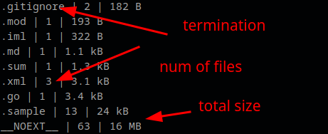

# About



Displays categorized information about file terminations, num of files and total size
Sorts by showing the largest size last.
It shows 3 columns: 





* termination
* number of files using that termination 
* total size of files with that termination 


__NOEXT__ termination means that the files have no termination, probably binaries


# install
* I provided a binary for Linux which you can download at https://github.com/adrianlarion/tsls/tree/main/binaries/linux

* optionally use `chmod +x tsls`
* run by using `./tsls`
* optionally you can place this executable in your path so you can run it from anywhere
* - eg; create `bin` dir in your `$HOME`, place executables there, add to your `.bashrc` the line `export PATH="~/bin:$PATH"`, then source it `so ~/.bashrc`

# Build
`git clone https://github.com/adrianlarion/tsls`
* go inside tsls dir
```
go mod tidy
go build .

```

# usage
```
Usage: tsls [--bytes] [--reverse] [DIR]

Positional arguments:
  DIR                    target directory

Options:
  --bytes, -b            show bytes instead of human readable size
  --reverse, -r          reverse sort
  --help, -h             display this help and exit


```